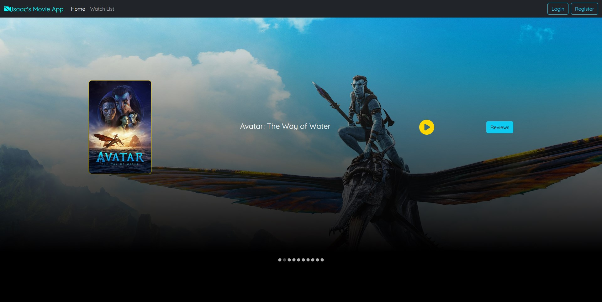
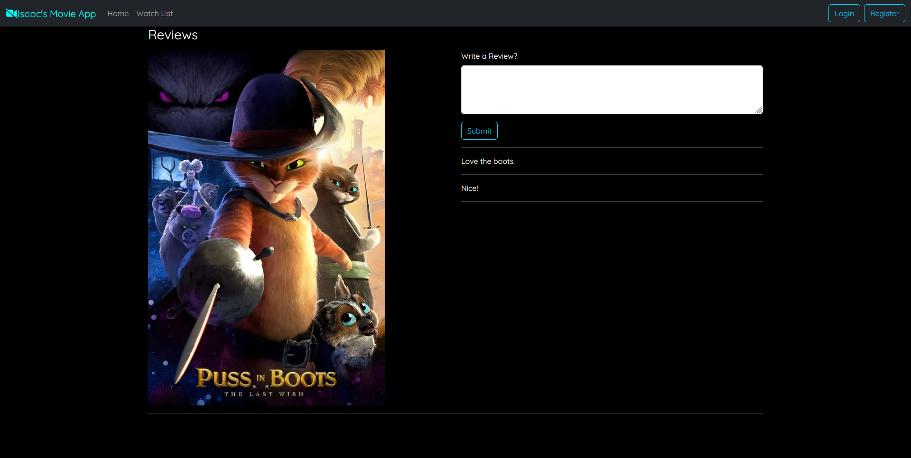

# IMDB Clone Full Stack Implementation: Back end

This codebase contains the Java code to enable the movie application to store data.

It utilizes the Spring Boot framework to create REST API endpoints and MongoDB to store movie and review information.

# To run
First, you will need to open the project in an `IDE` that supports building projects with `gradle`.

This project uses `Java 17`. Make sure you are using this version of Java.

You will need to create a file named `.env` and put it under *src/main/resources*

In the `.env` file, enter a MongoDB name, username, password, and cluster link. You may follow the .env.example file in that location as a reference.

Once the `.env` file is set, simply run the MovieApplication.java file.

You'll then need to run the front end part of the application. To do that, visit this link: https://github.com/IsaacMFernandes/movie_application_backend